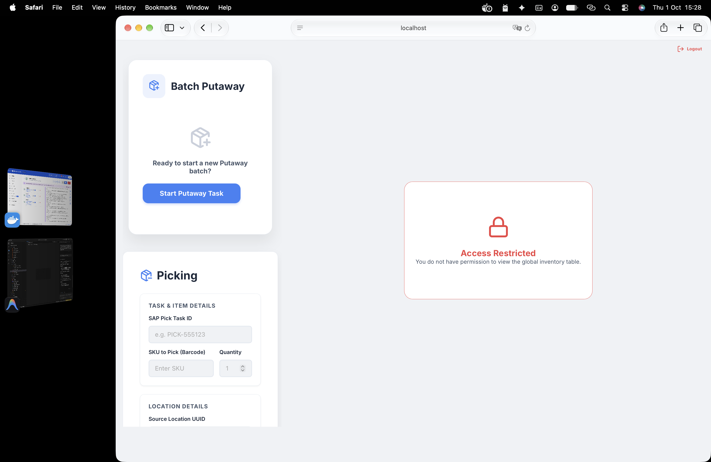
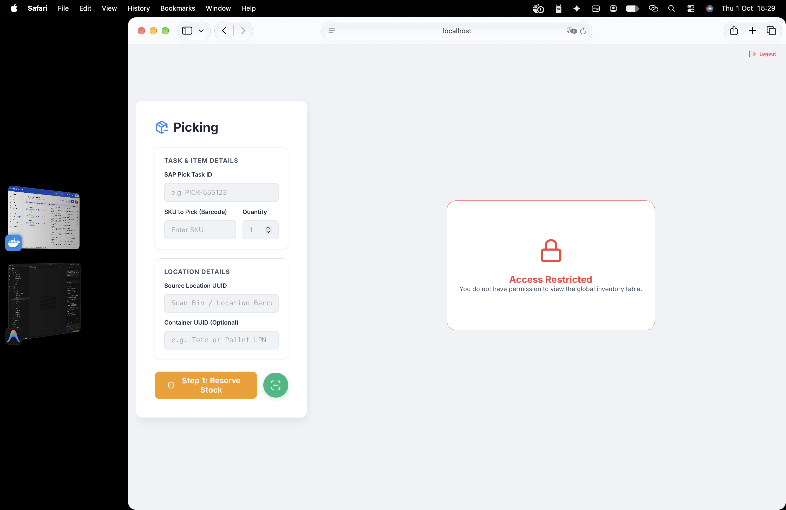

# Enterprise Inventory Service

A robust, highly concurrent Warehouse Management & Inventory System.

## Tech Stack
- **Backend**: Java, Spring Boot, Spring Security (JWT)
- **Frontend**: React, Vite
- **Database**: PostgreSQL (System of record)
- **Caching & Locks**: Redis (Rate limiting, Idempotency, Token Blacklist)
- **Event Streaming**: Redpanda/Kafka (Async integrations)

## Demo / Screenshots

Here are some previews of the running application:

### Interface

### Dashboard

### Operations

### Workflows

### Real-time Logs

